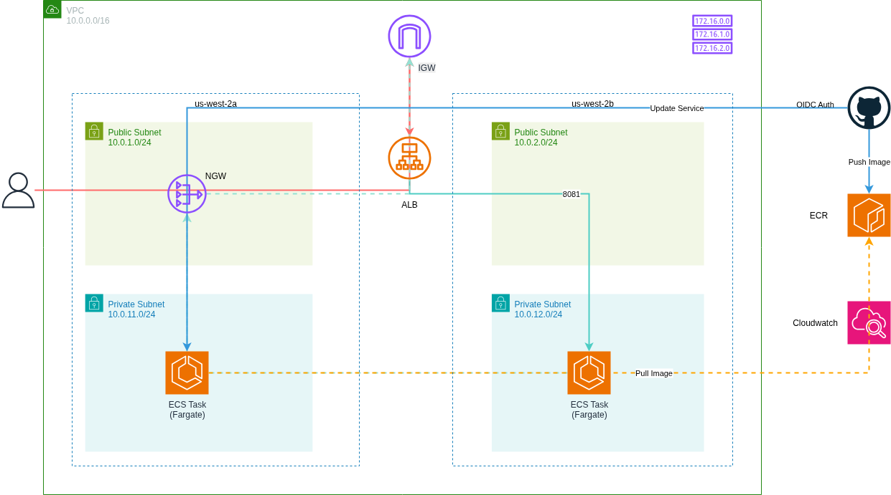

# AWS ECS Fargate Deployment Console Guide

Manual deployment of a containerized Node.js application on AWS ECS Fargate using the AWS Management Console.

## Architecture



The infrastructure uses a multi-tier architecture with:

- **VPC**: Custom VPC (10.0.0.0/16) spanning 2 availability zones (us-west-2a, us-west-2b)
- **Public Subnets**: Host Application Load Balancer with internet access via Internet Gateway
- **Private Subnets**: Host ECS Fargate tasks with outbound access via NAT Gateway
- **Application Load Balancer**: Distributes HTTP traffic (port 80) to ECS tasks
- **ECS Fargate**: Runs 2 containerized Node.js tasks on port 8081
- **ECR**: Stores Docker container images
- **CloudWatch Logs**: Centralized logging for all container output

## Prerequisites

- AWS account with administrative access
- Node.js application ready for containerization
- Docker installed locally
- GitHub account and repository
- Basic understanding of AWS services (VPC, ECS, IAM)

## Resources Created

This deployment creates the following AWS resources:

**Networking:**
- 1 VPC
- 4 Subnets (2 public, 2 private)
- 1 Internet Gateway
- 1 NAT Gateway with Elastic IP
- 2 Route Tables

**Compute & Load Balancing:**
- 1 Application Load Balancer
- 1 Target Group (IP-based)
- 1 ECS Cluster (Fargate)
- 1 Task Definition
- 1 ECS Service (2 tasks)

**Container Registry:**
- 1 ECR Repository

**Security:**
- 2 Security Groups (ALB, ECS)
- 3 IAM Roles (GitHub Actions, Task Execution, Task Role)
- 1 OIDC Identity Provider (GitHub)

**Monitoring:**
- 1 CloudWatch Log Group

## Docker Image Preparation

Before deploying, prepare your Docker image:

1. Create a Dockerfile for your Node.js application
   - Use Node.js base image (e.g., node:18-alpine)
   - Expose port 8081
   - Define application startup command

2. Build the Docker image locally:
   ```bash
   docker build -t wu-repo/task13:latest .
   ```

3. Authenticate with ECR:
   ```bash
   aws ecr get-login-password --region us-west-2 | docker login --username AWS --password-stdin <account-id>.dkr.ecr.us-west-2.amazonaws.com
   ```

4. Tag and push to ECR:
   ```bash
   docker tag wu-repo/task13:latest <account-id>.dkr.ecr.us-west-2.amazonaws.com/wu-repo/task13:latest
   docker push <account-id>.dkr.ecr.us-west-2.amazonaws.com/wu-repo/task13:latest
   ```

## GitHub Actions CI/CD Pipeline

The deployment includes an automated CI/CD pipeline with 8 stages:

1. **Checkout** - Clone repository code
2. **AWS Authentication** - Authenticate using OIDC (no stored credentials)
3. **ECR Login** - Authenticate Docker with Amazon ECR
4. **Build & Push** - Build image with commit SHA tag and push to ECR
5. **Download Task Definition** - Fetch current ECS task definition
6. **Clean Task Definition** - Remove AWS-managed fields
7. **Render Task Definition** - Update with new image URI
8. **Deploy to ECS** - Register new task definition and update service

## Testing the Pipeline

1. Make a code change to your Node.js application
2. Commit and push to the `main` branch:
   ```bash
   git add .
   git commit -m "Update application"
   git push origin main
   ```
3. Monitor the workflow:
   - Navigate to GitHub repository → Actions tab
   - Watch all 8 stages execute
   - Verify successful completion

4. Verify deployment:
   - Check ECR for new image with commit SHA tag
   - Navigate to ECS console → verify new task definition revision
   - Confirm new tasks are running and healthy
   - Access ALB DNS name in browser to see updated application

5. Check CloudWatch Logs:
   - Go to CloudWatch Logs console
   - Find log group
   - Verify new log streams for deployed tasks

## Accessing the Application

After deployment, access your application using the ALB DNS name:

Find the ALB DNS name in EC2 Console → Load Balancers 

## Security Features

- ECS tasks run in private subnets (no direct internet access)
- Only ALB can reach ECS tasks (security group restriction)
- OIDC authentication for GitHub Actions (no stored credentials)
- Least-privilege IAM policies
- Network isolation via VPC and security groups


**Deployed manually via AWS Console with automated CI/CD using GitHub Actions**
